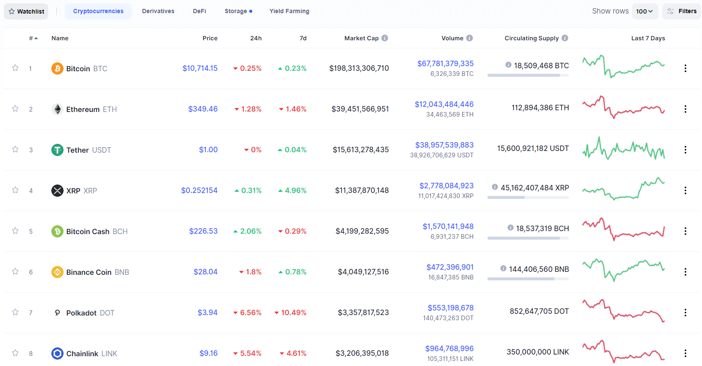

Coinbase -

**Case Study **

## Overview and Origin

* Name of company **- Coinbase**

* When was the company incorporated? - **company was founded in 2011**

* Who are the founders of the company? - *Founder(s): Brian Armstrong; Fred Ehrsam**

* How did the idea for the company (or project) come about?

Bloomberg wealth article (published feb 26th 2021)

*working as an engineer at Airbnb caused him to see the difficulties of handling payments from around the world. That led to the idea of creating a digital wallet to hold Bitcoin, which later became Coinbase Global Inc**

* How is the company funded? How much funding have they received?

Sites Wikipedia

*In May 2013, the company received a US$5 million Series A investment led by Fred Wilson from the venture capital firm Union Square Ventures. In December the same year, the company received a US$25 million investment, from the venture capital firms Andreessen Horowitz, Union Square Ventures (USV), and Ribbit Capital.

*Crunchbase.com

sights total amount for funding since founded is 547.3 million

Business Activities: What specific financial problem is the company or project trying to solve?

Sighting BBB.org the highest percentage of complaints came from

Problem with a Product or Service

Some of the issues Coinbase has addressed were connectivity issues due to bitcoin volatility

One other issue is the speed in adding new tokens which can add more users as new tokens are acquired**

*Via Cryptobreifing.com*

*Coinbase Custody will support six new tokens. The latest addition includes four DeFi tokens: Curve (CRV), Ren Protocol (REN), NuCypher (NU), and DFI Money (YFII). It also includes two wrapped Bitcoin tokens: wBTC and tBTC, both of which allow Bitcoin to be spent on Ethereum's wide selection of DeFi apps.

* Who is the company's intended customer? Is there any information about the market size of this set of customers? What solution does this company offer that their competitors do not or cannot offer? (What is the unfair advantage they utilize?)

The intended customer for Coinbase ranges from the naves trader who is just learning about crypto to the large volume traders with millions of tokens on the platform. Via businessofapps.com the number of users has grown by 43 million since 2014

*Note: 50 percent of Coinbase revenue in 2017 came during December, when the price of Bitcoin rose from $6,540 to $14,782. One of the noticeable advantages Coinbase has is the one of the first movers in an emerging industry.* his provides them the potential for fast customer growth.

Cost: Extremely low variable cost enables Coinbase to provide low-cost fee structure to compete against traditional payment processors, and even free service for the first $1M withdrawals.

Ease of use: Helps build trust amongst new potential customers and avoids customers leaving the service because they do not understand how to use it.

* Which technologies are they currently using, and how are they implementing them? (This may take a little bit of sleuthing–– you may want to search the company’s engineering blog or use sites like Stack share to find this information.)

**Coinbase has integrated the following programs**

* Easy digital download- Easy Digital Downloads is a complete eCommerce solution for selling digital products

 * Status ticker- See the latest statuses of your most critical services, all in one place.

* Hiveage- Hiveage is an online invoicing software-as-a-service from Hiveage Inc. It is designed from the ground up to serve small businesses worldwide.

* Peach pay - is the first payment software that lets you choose how to split the transaction fees. Set-up your custom branded Pay Me page and accept traditional payments as well as your choice of cryptocurrencies.

**Landscape:  What domain of the financial industry is the company in?  What have been the major trends and innovations of this domain over the last 5-10 years?  What are the other major companies in this domain?

**Coinbase is in the invest and trade with cryptocurrencies. This domain has exploded exponentially. And has solidified a legitimate new means of investing and transferring currency. The expansion of this domain has caused a new introduction of investing to the everyday person.** **Blockchain has become a new frontier of venture capitals that has attracted the attention of banks, governments, and other business corporations. www.Investopedia.com**

* in an article published in 2020 stated “Blockchain technology may be the most important invention since the internet”. This technology has the potential to impact so many different fascists of our lives. From content distribution, Real-estate, Travel, online advertising, Energy, Healthcare and more. Ultimately if blockchain technology is integrated it could vastly improve the current digital infrastructure in place.**

**Other major players in this domain are**

* Swift

* Ethereum

* J.P Morgan

* IBM

* Linux

* Microsoft

 Results\* What has been the business impact of this company so far? \* What are some of the core metrics that companies in this domain use to measure success? How is your company performing, based on these metrics? \* How is your company performing relative to competitors in the same domain?

[www.fastcompany.com](http://www.fastcompany.com)

Coinbase has recently gone public after becoming the largest US broker of digital currency their success eclipses the competition in the market today. Companies in this field measure their success by

[www.zdnet.com](http://www.zdnet.com)

Some core metrics most companies use to measure success

* Auditability: mistakes eliminated**

* Compliance: risk mitigated**

* Data management: improved product forecasting**

* Ownership: improved customer experience.**

* Transparency: improved incident response rate**

* Trust: mitigated business risk**

**Marketplace creation: new markets created**

Based on the current standard of metrics that measure revenue and evaluation gain, Coinbase has become the largest cryptocurrency trading company

Recommendations If you were to advise the company, what products or services would you suggest they offer? (This could be something that a competitor offers, or use your imagination!) Why do you think that offering this product or service would benefit the company?  What technologies would this additional product or service utilize? Why are these technologies appropriate for your solution?

One component that I would like to change is the control of the wallet keys

Wallet keys - A cryptocurrency wallet is a piece of software that keeps track of the secret keys used to digitally sign cryptocurrency transactions for distributed ledgers. Because those keys are the only way to prove ownership of digital assets – and to execute transactions that transfer them or change them in some way – they are a critical piece of the cryptocurrency ecosystem. Creating ways for users to control their own crypto currency would be a major step for Coinbase.

_sourcing list_

[www.zdnet.com](http://www.zdnet.com)

[www.fastcompany.com](http://www.fastcompany.com)

**www.Investopedia.com**

[**www.Cryptobreifing.com**](http://www.Cryptobreifing.com)

**BBB.org**

**www.Wikipedia.com**

**www.Bloomberg wealth article.com**
